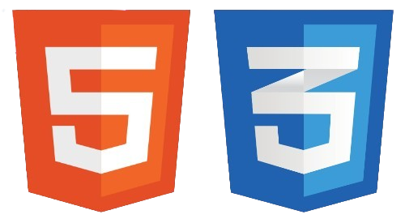

# HTML5 &amp; CSS3

Este repositório contém os estudos sobre <strong>HTML5 e CSS3</strong> através do <a href="https://cursoemvideo.com">Curso em Vídeo</a> e <a href="https://hcode.com.br">Hcode</a>.

	
Existem 3 pastas principais:

	<ul>
		<li><a href="https://github.com/nadsondejesusalmeida/html-css/tree/main/exercises">Exercícios</a>: contém os principais exercícios feitos através do <strong>Curso em Vídeo</strong>.</li>
		<li><a href="https://github.com/nadsondejesusalmeida/html-css/tree/main/challenges">Desafios</a>: contém os desafios propostos pelo <strong>Curso em Vídeo</strong>.</li>
		<li><a href="https://github.com/nadsondejesusalmeida/html-css/tree/main/bonus">Bônus</a>: Estudos extras que foram estudados através da <strong>Hcode</strong>.</li>
	</ul>

